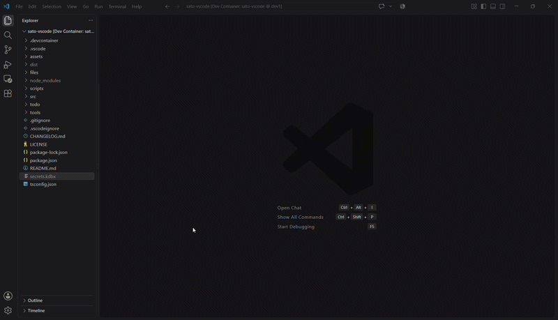

# SATO - Secure Access Task Operator for VS Code

Open, browse, edit and manage KeePass `.kdbx` Database (DB), Password Safe `.psafe3` / `.ibak` vaults, and common [crypto files](#supported-formats) directly inside VS Code `v1.100.0+` with a single UI.

> **Status:** In development. Use in production environments at your own risk.

> Bugs? Questions? Suggestions? Welcome to [GitHub](https://github.com/Marcus-Aprelius/sato-vscode/issues).

---

---

---

## Security

- Passwords and decrypted data are held in memory only
- Vaults are re-encrypted on save
- OpenPGP keys use a temporary GPG directory
- Clipboard auto-clear and auto-lock are configurable
- No cloud services or telemetry

---

## Usage

1. Open vault or cryptofile of any [supported format](#supported-formats).

2. For vault files, enter the master password.

3. For crypto containers, use `Tools` → `Unlock Container` or the details pane button.

4. Use the toolbar or right-click context menus to manage groups, entries and crypto file actions.

5. Use `Tools` → `Lock Database` to lock a password vault.

6. Also, ommands from Command Palette `Ctrl/Cmd + Shift + P`:

  - `SATO: Open Password Vault`
  - `SATO: Lock Vault`
  - `SATO: Reload Vault`

---

## Supported Formats

| Type        | Format       | Required tool | Status                                               |
|-------------|--------------|---------------|------------------------------------------------------|
| Vault       | `.kdbx`      | -             | Read and write                                       |
| Vault       | `.psafe3`    | -             | Read and write (writing notes is limited)            |
| Vault       | `.ibak`      | -             | Read and write backup file (edit with caution)       |
| Vault       | `.1pif`      | -             | Read-only                                            |
| Vault       | `.bcup`      | -             | Read-only                                            |
| Crypto file | `.crt`       | -             | View X.509 certificate details                       |
| Crypto file | `.cer`       | -             | View X.509 certificate details                       |
| Crypto file | `.der`       | -             | View DER-encoded X.509 certificate details           |
| Crypto file | `.pem`       | -             | View certificate, CSR, or private key details        |
| Crypto file | `.key`       | -             | View private key metadata                            |
| Crypto file | `.csr`       | `OpenSSL`     | View certificate signing request details             |
| Crypto file | `.p10`       | `OpenSSL`     | View PKCS#10 certificate signing request details     |
| Crypto file | `.p12`       | `OpenSSL`     | View and unlock PKCS#12 container                    |
| Crypto file | `.pfx`       | `OpenSSL`     | View and unlock PKCS#12 container                    |
| Crypto file | `.p7b`       | `OpenSSL`     | View PKCS#7 certificate chain                        |
| Crypto file | `.p7c`       | `OpenSSL`     | View PKCS#7 certificate chain                        |
| Crypto file | `.p7s`       | `OpenSSL`     | View PKCS#7 digital signature details                |
| Crypto file | `.p7m`       | `OpenSSL`     | View CMS/S/MIME message details                      |
| Crypto file | `.p8`        | -             | View PKCS#8 private key                              |
| Crypto file | `.pk8`       | -             | View and unlock PKCS#8 private key                   |
| Crypto file | `.ppk`       | `puttygen`    | View and unlock PuTTY private keys                   |
| Crypto file | `id_rsa`     | `ssh-keygen`  | View and unlock OpenSSH RSA private keys             |
| Crypto file | `id_ecdsa`   | `ssh-keygen`  | View and unlock OpenSSH ECDSA private keys           |
| Crypto file | `id_ed25519` | `ssh-keygen`  | View and unlock OpenSSH Ed25519 private keys         |
| Crypto file | `.jks`       | `keytool`     | View and unlock Java KeyStore                        |
| Crypto file | `.jceks`     | `keytool`     | View and unlock Java Cryptography Extension KeyStore |
| Crypto file | `.gpg`       | `GPG`         | View and decrypt OpenPGP messages                    |
| Crypto file | `.pgp`       | `GPG`         | View and decrypt OpenPGP messages                    |
| Crypto file | `.asc`       | `GPG`         | View OpenPGP public and private keys                 |
| Crypto file | `.sig`       | `GPG`         | View OpenPGP signature details                       |

## External Tools Installation

| OS                  | Installation / Commands                                                                 |
|---------------------|-----------------------------------------------------------------------------------------|
| `Debian` / `Ubuntu` | `sudo apt install -y openssl gnupg default-jre-headless putty-tools openssh-client`     |
| `Fedora` / `RHEL`   | `sudo dnf install -y openssl gnupg2 java-latest-openjdk-headless putty openssh-clients` |
| `Arch Linux`        | `sudo pacman -S openssl gnupg jre-openjdk-headless putty openssh`                       |
| `Alpine Linux`      | `sudo apk add openssl gnupg openjdk17-jre-headless putty openssh-client`                |
| `macOS`             | `brew install openssl gnupg openjdk putty`                                              |
| `Windows`           | **Install:** - `Gpg4win` - `OpenSSL for Windows` - `OpenJDK or another Java Runtime` - `PuTTY` (includes `puttygen`) - `OpenSSH Client` Windows optional feature **Ensure:** - `openssl`, `gpg` and `keytool` are available in PATH **Verify:** - `openssl version` - `gpg --version` - `keytool -help` - `puttygen --version`                              |

---

## Features

| Feature                | Details |
|------------------------|---------|
| **Vault management**   | Three-pane viewer for groups, entries, and details Read and write vaults from **Supported Formats** Create, edit, duplicate, and delete entries Create, rename, and delete groups |
| **Crypto file viewer** | Inspect different crypto files from **Supported Formats** Unlock crypto containers Decrypt OpenPGP messages View metadata, fingerprints, hashes, and decrypted content |
| **Quick actions**      | Show, hide, and copy passwords or private keys Copy usernames, URLs, notes, paths, and fingerprints Open URLs directly from entry details Show or hide empty values |
| **Search**             | Search vault entries and crypto metadata Search titles, usernames, URLs Search notes, subjects, issuers, paths, and fingerprints |
| **Password generator** | Configurable length and character sets Password strength indicator Entry editor integration and one-click copy |
| **Security controls**  | Lock and reload vaults Lock containers and hide decrypted content Configurable auto-lock and clipboard auto-clear Checks for required external tools |
| **Interface**          | File, Entry, Folder, Tools, View, and Help menus File and database information Status bar with vault statistics or crypto metadata Update check from the Help menu |

---

## Extension Settings

| Setting                        | Description                                                                            |
|--------------------------------|----------------------------------------------------------------------------------------|
| `sato.autoLockTimeout`         | Auto-lock vault after N minutes of inactivity. `0` disables auto-lock               |
| `sato.clipboardClearTimeout`   | Clear clipboard N seconds after copying a secret. `0` disables clipboard auto-clear |
| `sato.passwordGeneratorLength` | Default password length used by the generator                                          |
| `sato.confirmBeforeDelete`     | Ask for confirmation before deleting entries or folders                                |
| `sato.showPasswordsByDefault`  | Reveal passwords automatically in the entry details pane                               |
| `sato.showStatusBar`           | Show or hide the vault statistics bar                                                  |

---

## Development

Open folder `.devcontainer` in VSCode and use commands:

| Action                            | Command                                                                 |
|-----------------------------------|-------------------------------------------------------------------------|
| 1. Install dependencies           | `npm install`                                                           |
| 2. Build the project              | `npm run build`                                                         |
| 3. Package `.vsix` extension      | `npm run package`                                                       |
| 4. Install generated `.vsix` file | `code --install-extension files/sato-vscode-ext-<version>.vsix --force` |

---

## Repository
**VS Code extension**: https://github.com/Marcus-Aprelius/sato-vscode

**SATO command line tool**: https://github.com/Marcus-Aprelius/sato

---

[MIT LICENSE](LICENSE)

---

© 2026 [Marcus-Aprelius](https://github.com/Marcus-Aprelius/sato-vscode)

**Discord:** Marcus.Aprelius.Antoninus
