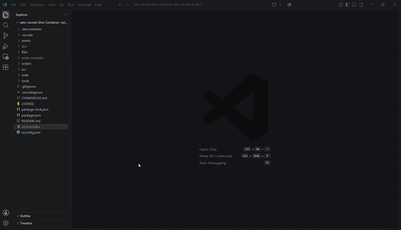

# SATO - Secure Access Task Operator for VS Code

Open, browse, edit and manage vaults (`.kdbx`, `.psafe3`, `.ibak`), and common [crypto files](#supported-formats) directly inside VS Code `v1.100.0+` with a single UI.

> **⚠️ Status:** In development. Use in production environments at your own risk.

> **💬 Feedback:** Bugs? Questions? Suggestions? Welcome to [GitHub](https://github.com/Marcus-Aprelius/sato-vscode/issues).

---

---

---

## Security

- Passwords and decrypted data are held in memory only
- Vaults are re-encrypted on save
- OpenPGP keys use a temporary GPG directory
- Clipboard auto-clear and auto-lock are configurable
- No cloud services or telemetry

---

## Usage

1. Open vault or cryptofile of any [supported format](#supported-formats).

2. For vault files, enter the master password.

3. For crypto containers, use `Tools` → `Unlock Container` or the details pane button.

4. Use the toolbar or right-click context menus to manage groups, entries and crypto file actions.

5. Use `Tools` → `Lock Database` to lock a password vault.

6. Also, commands from Command Palette `Ctrl/Cmd + Shift + P`:

  - `SATO: Open Password Vault`
  - `SATO: Lock Vault`
  - `SATO: Reload Vault`

---

## SATO Supported Formats And External Tools

### Supported Formats

| Format       | Description                                                  | `SATO` Base Actions                           |
|--------------|--------------------------------------------------------------|-----------------------------------------------|
| `.kdbx`      | KeePass `vault` database                                     | Read and write                                |
| `.psafe3`    | Password Safe `vault` database                               | Read and write                                |
| `.ibak`      | Password Safe backup `vault`                                 | Read and write with caution                   |
| `.1pif`      | 1Password Interchange Format `vault` export                  | Read-only (RO)                                |
| `.bcup`      | Buttercup `vault`                                            | Read-only (RO)                                |
| `.crt`       | X.509 `certificate`                                          | View and convert PEM/DER files                |
| `.cer`       | X.509 `certificate` in PEM or DER encoding                   | View and convert PEM/DER files                |
| `.der`       | DER-encoded X.509 `certificate`                              | View and convert to PEM                       |
| `.pem`       | `PEM certificate`, CSR, public key, or private key (PK)      | View, unlock PKs, and convert X.509 files     |
| `.p8`        | PKCS#8 `private key`                                         | View                                          |
| `.pk8`       | PKCS#8 `private key`                                         | View and unlock                               |
| `.key`       | PEM-encoded `private key`                                    | View and unlock                               |
| `.age`       | `Encrypted file` with encoding and protection type detection | RO inspection; file contents aren't decrypted |
| `.pub`       |  Ed25519 RSA, ECDSA, or `OpenSSH public key`                 | View metadata and SHA-256 fingerprint         |
| `.rsa`       | Private or public `RSA  key` in PEM or DER encoding          | View metadata and supported PK content        |
| `.ec`        | Private or public `EC key` in PEM or DER encoding            | View, convert, and extract public keys        |
| `.csr`       | `Certificate Signing Request` (`CSR`)                        | View                                          |
| `.p10`       | PKCS#10 `Certificate Signing Request`                        | View                                          |
| `.p12`       | PKCS#12 certificate and PK `container`                       | View, unlock, and show PK                     |
| `.pfx`       | PKCS#12 certificate and PK `container`                       | View, unlock, and show PK                     |
| `.p7b`       | PKCS#7 `certificate chain`                                   | View                                          |
| `.p7c`       | PKCS#7 `certificate chain `                                  | View                                          |
| `.p7s`       | PKCS#7/CMS `digital signature`                               | View                                          |
| `.p7m`       | S/MIME or PKCS#7/`CMS message`                               | View                                          |
| `.spc`       | PKCS#7/CMS `Authenticode container`                          | View certificates, signatures and CMS details |
| `.ppk`       | PuTTY `private key`                                          | View and unlock                               |
| `id_rsa`     | OpenSSH RSA `private key`                                    | View and unlock                               |
| `id_ecdsa`   | OpenSSH ECDSA `private key`                                  | View and unlock                               |
| `id_ed25519` | OpenSSH Ed25519 `private key`                                | View and unlock                               |
| `.jks`       | Java `KeyStore`                                              | View and unlock                               |
| `.jceks`     | Java Cryptography Extension `KeyStore`                       | View and unlock                               |
| `.gpg`       | Binary `OpenPGP key`, message, or encrypted file             | View packet information and decrypt messages  |
| `.pgp`       | Binary `OpenPGP key`, message, or encrypted file             | View packet information and decrypt messages  |
| `.asc`       | ASCII-armored `OpenPGP key`, message, or signature           | View packet information and decrypt messages  |
| `.sig`       | Detached `OpenPGP signature`                                 | View signature and packet information         |

### Additional Features of External Tools

| External tool | Formats                            | `SATO` Extended Actions                                                               |
|---------------|------------------------------------|---------------------------------------------------------------------------------------|
| `OpenSSL`     | `.csr`, `.p10`                     | Parse and display CSR details                                                         |
| `OpenSSL`     | `.p12`, `.pfx`                     | Unlock containers, inspect certificates, and extract PK                               |
| `OpenSSL`     | `.p7b`, `.p7c`                     | Extract and inspect certificate chains                                                |
| `OpenSSL`     | `.p7s`                             | Inspect CMS signatures and signer information                                         |
| `OpenSSL`     | `.p7m`                             | Inspect CMS/S/MIME structure and embedded certificates                                |
| `OpenSSL`     | `.spc`                             | Inspect CMS/PKCS#7 structure, view embedded certificates, and convert or extract them |
| `puttygen`    | `.ppk`                             | Unlock and inspect PuTTY PK                                                           |
| `ssh-keygen`  | `id_rsa`, `id_ecdsa`, `id_ed25519` | Unlock and inspect OpenSSH PK                                                         |
| `keytool`     | `.jks`, `.jceks`                   | Unlock KeyStores and inspect aliases, owners, issuers, and certificates               |
| `GPG`         | `.gpg`, `.pgp`                     | Inspect OpenPGP packets and decrypt supported messages                                |
| `GPG`         | `.asc`                             | Inspect armored keys, signatures, and decrypt supported messages                      |
| `GPG`         | `.sig`                             | Inspect OpenPGP signature details                                                     |

### External Tools Installation

| OS            | Installation/Commands                                                                 |
|---------------|---------------------------------------------------------------------------------------|
| Debian/Ubuntu | sudo apt install -y openssl gnupg default-jre-headless putty-tools openssh-client     |
| Fedora/RHEL   | sudo dnf install -y openssl gnupg2 java-latest-openjdk-headless putty openssh-clients |
| Arch Linux    | sudo pacman -S openssl gnupg jre-openjdk-headless putty openssh                       |
| Alpine Linux  | sudo apk add openssl gnupg openjdk17-jre-headless putty openssh-client                |
| macOS         | brew install openssl gnupg openjdk putty`                                             |
| Windows       | **Install:** - Gpg4win, OpenSSL for Windows, PuTTY (includes puttygen) - OpenJDK or another Java Runtime - OpenSSH Client Windows optional feature **Ensure:** - openssl, gpg and keytool are available in PATH                              |

---

## Features

| Feature                | Details |
|------------------------|---------|
| **Vault management**   | Three-pane viewer for groups, entries, and details Read and write supported vault formats Create, edit, duplicate, and delete entries Create, rename, and delete groups |
| **Crypto file viewer** | Two-pane viewer for crypto files and details and keys Inspect files listed in **Supported Formats** Unlock supported crypto containers and encrypted PK View metadata, fingerprints, hashes, and decrypted content |
| **Сonverter**          | Convert X.509 certificates between PEM and DER formats View source certificate information before conversion Configure the output format and file name Access conversion from the Tools menu or crypto file context menu |
| **Quick actions**      | Show, hide, and copy passwords Copy PK, usernames, URLs, notes, paths and other values Open URLs directly from entry details Show or hide empty values |
| **Search**             | Search vault entries and crypto metadata Search titles, usernames, URLs Search notes, subjects, issuers, paths, and fingerprints |
| **Password generator** | Configurable length and character sets Password strength indicator Entry editor integration and one-click copy |
| **Security controls**  | Lock and reload vaults Lock containers and hide decrypted content Configurable auto-lock and clipboard auto-clear Checks for required external tools |
| **Interface**          | File, Entry, Folder, Tools, View, Settings, and Help menus File and database information Status bar with vault statistics or crypto metadata Update check from the Help menu |

---

## Extension Settings

| Setting                         | Description                                                                            |
|---------------------------------|----------------------------------------------------------------------------------------|
| `sato.autoLockTimeout`          | Auto-lock vault after N minutes of inactivity. `0` disables auto-lock               |
| `sato.clipboardClearTimeout`    | Clear clipboard N seconds after copying a secret. `0` disables clipboard auto-clear |
| `sato.passwordGeneratorLength`  | Default password length used by the generator                                          |
| `sato.confirmBeforeDelete`      | Ask for confirmation before deleting entries or folders                                |
| `sato.showPasswordsByDefault`   | Reveal passwords automatically in the entry details pane                               |
| `sato.showEmptyValuesByDefault` | Show empty values by default in vault and crypto file details                          |
| `sato.showStatusBar`            | Show or hide the vault statistics bar                                                  |

---

## Development

Open folder `.devcontainer` in VSCode and use commands:

| Action                         | Command                                                                 |
|--------------------------------|-------------------------------------------------------------------------|
| Install dependencies           | `npm install`                                                           |
| Build the project              | `npm run build`                                                         |
| Package `.vsix` extension      | `npm run package`                                                       |
| Install generated `.vsix` file | `code --install-extension files/sato-vscode-ext-<version>.vsix --force` |

---

## Links

[[git: sato-vscode](https://github.com/Marcus-Aprelius/sato-vscode)]
[[git: sato](https://github.com/Marcus-Aprelius/sato)]
[[LICENSE (MIT)](LICENSE)]
[[Teams (Skype)](marcus.aprelius.antoninus@gmail.com)]

[[DEV.to](https://dev.to/marcusaprelius)]
[[Medium.com](https://medium.com/@marcus.aprelius.antoninus)]

---

© 2026 [Marcus-Aprelius](https://github.com/Marcus-Aprelius)
